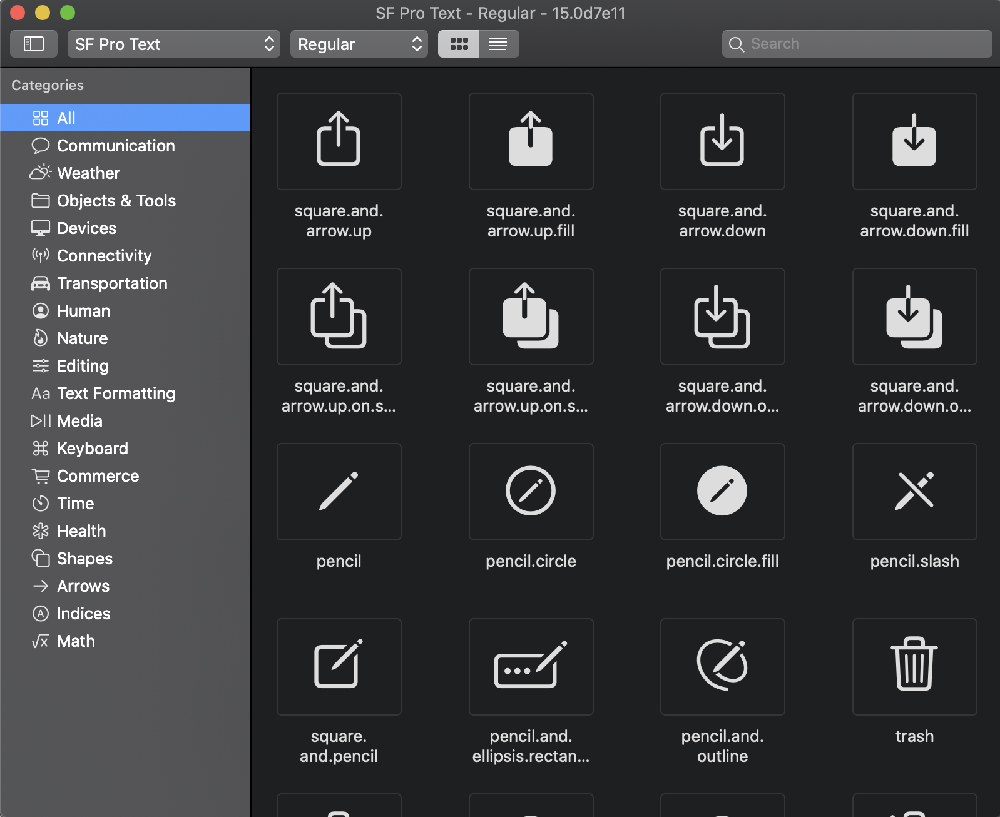
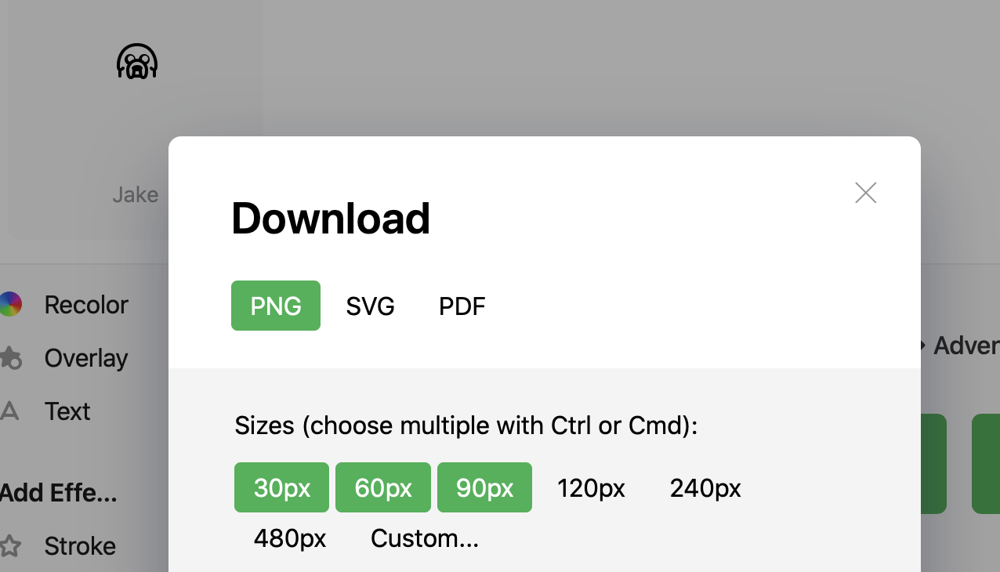
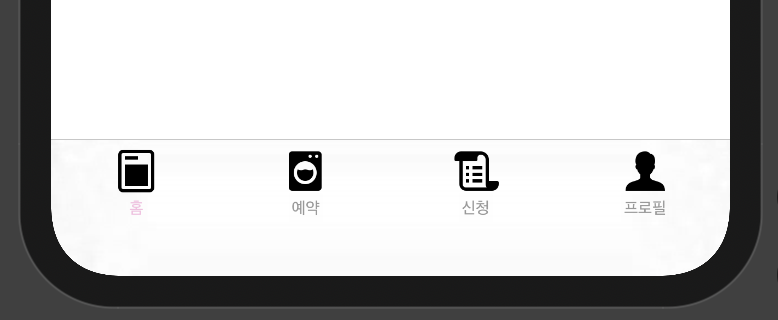

*SF Symbols 앱*

TabView를 사용할 때는 각 탭을 대표하는 아이콘을 지정해야 하는데, 우선은 시스템 아이콘을 둘러보는 것을 추천합니다. 시스템 아이콘이 생각보다 종류가 다양하고, 디자인도 깔끔해서 활용도가 높습니다.

[SF Symbols](https://developer.apple.com/design/human-interface-guidelines/sf-symbols/overview/) 앱에서 모든 시스템 아이콘 확인이 가능합니다.

하지만 시스템 아이콘으로는 부족한 경우가 가끔 있습니다. 괜찮은 아이콘을 찾던 중 [Icons8](https://icons8.com/icons/ios-glyphs)의 iOS-Glyph 아이콘이 마음에 들어 사용해보기로 했습니다.


*Icons8 사이트*

Assets의 Image Set에 1x, 2x, 3x 아이콘을 모두 집어넣으려면 30px, 60px, 90px 사이즈의 파일을 모두 받아주세요.


*Assets의 Image Set*

그리고 뷰 파일을 열고 `Image()` 안에 Image Set의 이름을 입력해 주세요.

```swift
.tabItem {
    Image(이미지 이름)
    Text("First")
}.tag(0)
```

시스템 아이콘이 아니므로 `systemName:` 레이블 없이 이미지 이름만 적어주면 됩니다.


*.original*

일단 아이콘이 뜨긴 했지만 Tint Color가 적용되지 않고 검은색으로 고정되어 있습니다. 한번 고쳐보도록 하죠.

### 1. Assets의 Attribute Inspector에서 해결하기


Render As의 값이 Default로 되어 있을 텐데 이걸 Template Image로 변경해 주세요. 다른 Image Set에도 각각 똑같이 적용하면 됩니다.

### 2. 뷰 파일에서 Image()에 코드 추가하기


`Image(이미지 이름)` 뒤에 `.renderingMode(.template)`를 추가해 주세요. 아이콘 수가 많을 경우 이 방법이 조금 더 유리하겠네요.


정상적으로 적용된 모습을 확인하실 수 있습니다.